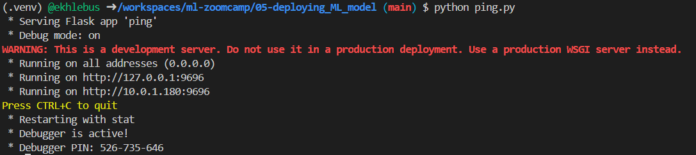

# Deploying Machine Learning Models

This repository contains info about saving, loading, and deployment churn prediction model.

**Deploy the model** means taking a trained machine-learning model and making it available for real-world use, so that new data can be sent to it and it can return predictions.

This usually involves putting the model into a production environment—such as a web service, API, cloud platform, or application—so that users or other systems can call it to get predictions.

## Files in this repo:

* **05-train-churn-model.ipynb**
    Jupyten notebook with code for saving and loading model.

* **train_churn_prediction.py**
    Python script from Jupyten notebook above for training churn prediction model. Running this script will train and save the model into **churn_prediction_model_C=1.bin**

* **churn_prediction.py**
    Python script from Jupyten notebook above for using previously saved model and making churn prediction.

* **ping.py**
    Python script for making simple ping-pong app as web service using Flask. After running this script (python ping.py) we can see something like below with address where it is running:


    To use the service, query it from the terminal using `curl`:

    ```bash
    curl http://0.0.0.0:9696/ping
    ```
    Or open it in a browser: http://localhost:9696/ping

* **churn_prediction_web-service.py**
    Python script for wrapping the **churn_prediction.py** script into a Flask app (serving the churn prediction model with Flask).

   To communicate with this web service we can use Jupyter notebook. Code for that is in the file **05-train-churn-model.ipynb**, section "Making requests".
   
   ⚠️ Since we are running the Flask in debug mode, every changes which are made in churn_prediction_web-service.py file during running our web service are detected. 
   In production deployment we need to use **WSGI server** instead of plain Flask.

   * As an example of WSGI server we can use `gunicorn` on MacOC or Linux (gunicorn does not support Windows):

       ```bash
        gunicorn --bind 0.0.0.0:9696 predict:app
        ```
        In this case the next part of **churn_prediction_web-service.py** script will not be executed, because it is in if statement, and here we will not get warnings since not it is in production mode (no debug mode): 
        ```bash
        if __name__ == "__main__":
        app.run(debug=True, host='0.0.0.0', port=9696)
        ```
    * On Windows we can use an alternative like `waitress` (https://www.devdungeon.com/content/run-python-wsgi-web-app-waitress):

    ```bash
    pip install waitress
    
    waitress-serve --listen=0.0.0.0:9696 predict:app 
    ```